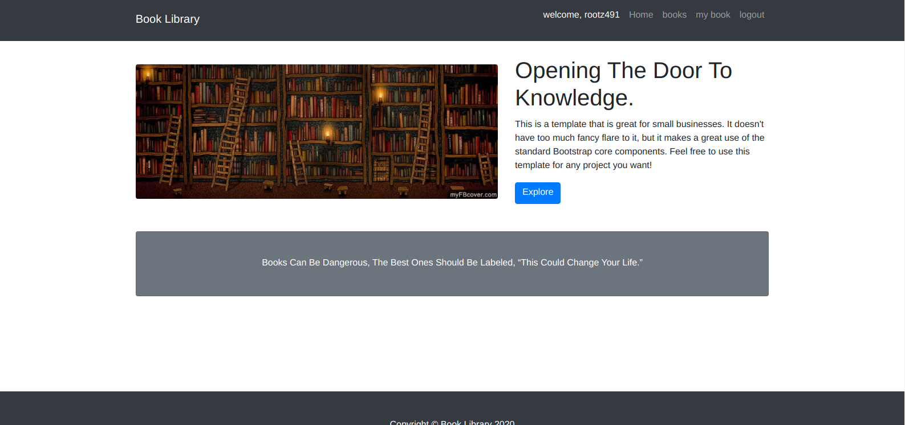

# pre-requisites

django 3.1.3

i'm using virtual environment to resolve the problem of multiple versions.
name of virtualEnv: django-iot

to access:  workon django-iot

to get out of virtual env:  deactivate


# ToDo

* models.py     **[DONE]**

* templates remaining (Bootstrap can be a good option)  **[DONE]**

* Views.py      **[DONE]**

* urls.py       **[DONE]**


# new things from this project

*   we can create functions inside the model, and can use them from templates.
    it can save much time, for example, through the functions, we can fetch data for
    for user and do some calculations with it and then, return the correspond response
    to the template.

*   we can also define templates in root directory, and they can be accessed from any 
    apps of that project. such templates can be: BASE.html, auth (login/signup) pages etc.
    
    *   first, go to __settings.py__
    *   add this code in the end:
        
        ```python
        TEMPLATES += [{ 'DIRS': [BASE_DIR / 'templates'], }]
        ```
    *   now, create a folder 'templates' in root directory and use those templates
        for inside the applications.
    
*   __PERMISSIONS__:    models can have specific permissions and those permissions can 
    be given to particular user or group also. permissions can distinguish b\w user's 
    abilities to work with database (read, write, update or delete).
    
    *   _creating permissions_: permission or created inside the model also.
        
        ```python
        class modelInstance(models.Model):
            ...
            class Meta:
                ...
                permissions = (("can_do_something", "short descriptions about perm"),)
        ``` 
    
    *   Now, permission is created, we can add this permission to specific user via admin
        panel (go to user's profile) or to specific group using same method.
       
    *   Now permissions are created and given to *user/Group* 
        it's time to check the permissions that particular user have from template and
        using conditions we can allow user to access specific block of code and do the
        corresponding task.
        
    *   current user's permissions are stored in template variable called **{{ perms }}** 
        
        *   check whether current user have specific permissions on particular application or not.
        
            ```html
            
                <!-- Perhaps add code to link to specific function from view, here. -->
            
            ```
    *   __SESSION__ are also very useful to work with user specific things like recent searches or
        theme color when last used website. However i didn't implemented/used it in this project.


#   Deployment

*   read [this](https://medium.com/@shashankmohabia/deploying-a-django-app-to-heroku-using-github-repository-319c04a11c1a) article
    
    *   change __settings.py__ accordingly!

*   create these files:
    
    *   Procfile
    *   Procfile.windows
    *   requirements.txt
    *   runtime.txt
    
*   heroku CLI

    ```shell script
    heroku create <app-name>
    git remote -v
    git add .
    git commit -m "those extra files for heroku"
    git push -u origin master
    ```
    *   Now go to: heroku site > current application > settings > add __BUILD PACK__ > choose **python**
    *   Then, go to: current application > Deploy > __connect to github__
    *   That's all here!

    ```shell script
    git push heroku master
    heroku run python3 manage.py migrate
    heroku run python3 manage.py createsuperuser
    ```

    *   Finally, Done! site's been deployed. check it [out](https://kibrary.herokuapp.com/)
    
        *   To check server logs.
    
            ```shell script
            heroku log --tail
            ```

